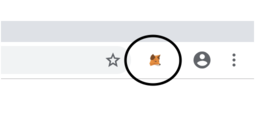
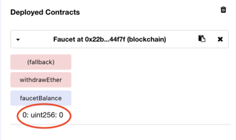

# Ethereum Workshop
Welcome to our Ethereum workshop. After completing this workshop you will be able to 
interact with the Ethereum network and also deploy your own smart contracts. 
Specifically you will learn to:
* own and transfer Ether
* interact with existing smart contracts
* deploy your own smart contract
* tokenize a real-world asset (i.e., chocolate)

## Your incentive
As with any blockchain project, there has to be an economic aspect to it, not just 
a technical one. This workshop is no exception. We would like to reward you with 
chocolate for completing your tasks. It order for you to trust that you will receive the 
chocolate, we assigned a trusted chocolate master. The master is not a human, but a 
smart contract. We divided all the chocolate we have in chocolate tokens and put it in 
the custody of the chocolate master. Every time you accomplish a task the chocolate 
master will check it and give you a chocolate token. At the end of the workshop you 
will show us how many chocolate tokens you have in your wallet and we'll hand you
in the physical chocolate coins.

## Workshop structure
The workshop has two parts: practice and exercises. First you will set everything up 
and learn to interact with smart contracts. Then you will have to do some exercises in 
order to win chocolate tokens.

## Practice
### Setting up Metamask
In order to interact with Ethereum, we have to install an Ethereum client. We will use 
a browser client called Metamask, that can be installed as a browser extension in 
Firefox or Google Chrome. Install one of those browsers if you don't have any of
them installed yet. Now you can install Metamask from here:
* for Firefox: https://addons.mozilla.org/en-US/firefox/addon/ether-metamask/
* for Google Chrome: https://chrome.google.com/webstore/detail/metamask/nkbihfbeogaeaoehlefnkodbefgpgknn 

Now you should see it in your addon bar.


Click on it and set a password in order to create your Ethereum account. Click 
_Create_, then _Next_, then scroll down the Terms of Use and click _Accept_, then again
_Accept_ for Privacy, and Phishing warning. A backup phrase will be generated. It can 
be used for later restoring your password. Store it somewhere safe as you'll need to 
fill it in in the next screen. Click _Next_. Fill in your backup phrase and click 
_Confirm_. Click the _X_ button. Now you should see your Ethereum address and that you 
own zero Ether. Your account is ready to use. Good job! You can pat yourself on the back.

To interact with Ethereum main network you will need Ether, the local crypto-currency, 
which costs money. However,
for testing purposes, there are alternative Ethereum networks in which Ether is 
worthless, thus free of charge. To make Metamask to use such a network at the top of 
the window instead of _Main Ethereum Network_ select _Ropsten Test Network_. Your 
Metamask should look like this:


### Getting Ether
Now we need some Ether. We will use an existing smart contract in this Ethereum 
network, called a _Test Faucet_,that owns lots of Ether and can give use 1 Ether at a 
time if we ask it. So click _Deposit_, then at the botton near _Test Faucet_ click _Get 
Ether_, and then click _Request 1 ether from faucet_. Shortly, you should see a 
transaction at the bottom of the page. It will take ~1 min for it to confirm. Once that
happens, you should see that you have 1 Ether in Metamask.

If that does not work, go to this page and click _Send me test ether_:
https://faucet.ropsten.be/

Good! We have Ether. Lets make a gift to someone.

### Transferring Ether
Let us now transfer some Ether to someone. Ask one of your colleagues to give you their
account address. You can use chat, or email, etc. They can copy their address by 
clicking on it in Metamask.
 
To transfer, go to Metamask and click _Send_. At _To_ paste your colleague's address. At 
_Amount_ type 0.001. 


Click _Next_ and then _Confirm_. Wait a few seconds for the transaction to get 
confirmed. It should show up in Metamask. The exact same process can be used to 
transfer Ether to a contract.

You colleague should see now that their balance increased with 0.001 Ether.

Nice! We can transfer Ether. Let's see some smart contracts.

### Deploying a smart contract
We used a faucet to get some Ether, but you might be wondering how does a faucet work. 
So let us create a faucet ourselves. 
We prepared most of the code for a faucet smart contract for you. Let's deploy it to 
Ethereum and later we shall explain how it works.

We will use Remix 
IDE to compile and deploy the contract. Go to https://remix.ethereum.org/. Close the tab 
called _ballot.sol_. Press on the plus image in the left top corner to add a new file. 
Call it Faucet.sol. In the newly created tab copy paste the code from this file: 
[Faucet](Faucet.sol).  Click on _Start to compile_. If compilation succeeds you should 
see no errors and your faucet ready to deploy:


To deploy the contract to Ethereum, go to the _Run_ tab. You should 
see that Metamask has set the Environment to point to the Ropsten network and pointed 
to your account, as in Metamask. Also you see that the Faucet is ready to deploy.


Click on _Deploy_. Deploying a contract is an Ethereum transaction itself. Metamask will 
prompt you to confirm the transaction. As you can see the transaction has a gas fee, 
which you have to always pay when transacting on Ethereum. Click _Confirm_. Wait a few 
seconds for the transaction to get confirmed. Metamask will notify you. You see now 
your deployed contract and its deployed address.


### Understanding the Faucet contract
The way a faucet works is, people can transfer Ether to it, which it stores, and it 
also provides a function that othere people can use to withdraw Ether. As simple as that.
Let's now look at the source code of our Faucet contract. It is written in the Solidity 
programming language. Solidity resembles very much object oriented programming, and a 
contract is similar to a OOP class.

Our contract has three functions. Let's start with the last one:

```
    function() public payable { }
```

In Ethereum not only people can own Ether, but also smart contracts. In order for a 
smart contract to be able to receive Ether it needs to have a function that is marked 
_payable_. So this is all this function does.

The second function is:

```
    function faucetBalance() public view returns (uint256) {
        return address(this).balance;
    }
```

It can be used to get the current Ether balance of this smart contract. `this` keyword 
represents the address of this smart contract. `.balance` is used for querying the 
Ether balance for any address.

The last function is:
```
    function withdrawEther() public {
        // Insert your code here
    }
```

This is the function we will use to withdraw Ether from the faucet. You will have to 
implement it later.

### Interacting with the Faucet contract
Let us first check contract's Ether balance. For that let's call the `faucetBalance()` 
function. In remix go to your deployed contract and expand it by pressing the arrow 
button. You will see all it functions there. Click on `faucetBalance`. The balance 
should be zero.



Later you will have to transfer Ether to it and the balance will increase.

Congratulations! You just learned to interact with your smart contract. Let's interact 
with other people's contracts.

### The chocolate token
As we said earlier we tokenized some physical chocolate and we deployed two smart 
contracts on Ethereum so that you can get your chocolate from them.

The first smart contract is called _ChocolateToken.sol_. It oversees who owns how many 
chocolate tokens. Let's load it in Remix. In Remix add one more file and call it 
_ChocolateToken.sol_. Into it copy paste the code from this file: 
[ChocolateToken.sol](ChocolateToken.sol). Click _Start to compile_ in the _Compile_ tab.

Now instead of deploying the contract, you will have to load the contract we deployed 
at this address: 0x0c0d9c61a56d3132b7248015e767acf318a9ce29 . For this, go to the _Run_
tab, select _ChocolateToken_, in _At Address_ field fill in the above address, and 
click on _At Address_. It should now show up in the _Deployed Contracts_.


This contract has three functions for managing token ownership: `transfer()`,
`balanceOf()`, and `totalSupply()`. 
These three functions are part of the ERC20 standard, which many Ethereum clients, including 
Metamask, support. This means that Metamask can show your wallet of chocolate tokens.
To do that, go to Metamask, click on the _Menu_ button, then _Add Token_, then _Custom 
Token_. In _Token Address_ fill in the address of the chocolate token contract from above.
In _Token Symbol_ fill in _Chocolate_. Click _Add Token_. You should now see that your 
balance is zero. It will increase as the chocolate master starts handing you tokens in.

### The chocolate master

The second contract we deployed is called _ChocolateMaster_. First add its code in Remix 
from this source: [ChocolateMaster.sol](ChocolateMaster.sol), compile it, and load it 
from this address: 0x8dc77e5a7f83e52a4151ca2f3e5e0a2ffec54c2c . You should see it 
loaded.


Awesome, the chocolate is up for grabs now! Go get it!

## Exercises

### 1. Basic income
Our chocolate master has been hanging out with his liberal friends and learnt about the 
idea of basic income, so he thought to try it out. The idea of basic income is that the
government pays every person in the state a basic fixed income, independent of their 
employment status, and the people can work to earn extra money.

So to get your basic income chocolate token, call the function `getBasicChocolateIncome()`
in the chocolate master contract. You should see in Metamask that you have a chocolate 
token.

### 2. Send Ether to your faucet

To make your faucet work you need to send it some Ether. Send it 0.002 Ether. When you 
are done, call `proveThatFaucetHasEther()` in the chocolate master contract. In the 
function specify the address of your faucet contract. You should get one more chocolate
token.

### 3. Make your faucet withdrawable

As we said earlier the function `withdrawEther()` from your faucet is not implemented yet.
Implement it such that it transfers some ether to the account calling the function. 
It does not matter how much much Ether you let us withdraw, as long as the faucet has it.
When you are done, call `proveThatEtherCanBeWithdrawn()` in the chocolate master, 
providing the address of your faucet contract. It will try to withdraw Ether. 
If it works, one more chocolate token for you.

Hints: 
* Every time you change the code of your faucet contract, you have to recompile
and redeploy it. Only use the latest deployed contract.
* `msg.sender` is the address of the callee of the function.

### Bonus: Make your faucet call 

So far you have always called the chocolate master contract manually, but contracts can
call contracts, too. Add a function to your faucet that calls the function 
`faucetInitiatesWithdraw()` from the chocolate master. It will again try to withdraw 
Ether, so make sure your faucet has Ether. If you are the first one to accomplish this,
you'll get the one and only bonus chocolate token.

Hint:
* when a contract calls another contract, `msg.sender` becomes the caller contract's 
address.

## Chocolate time
Congratulations! You conquered the blockchain. You can come to us and retrieve your 
delicious chocolate by showing us your token wallet. You deserved it! You can call 
yourself a blockchain expert from now on.

Feel free to acquire some Ether and try the same exercise on Ethereum's main network.

